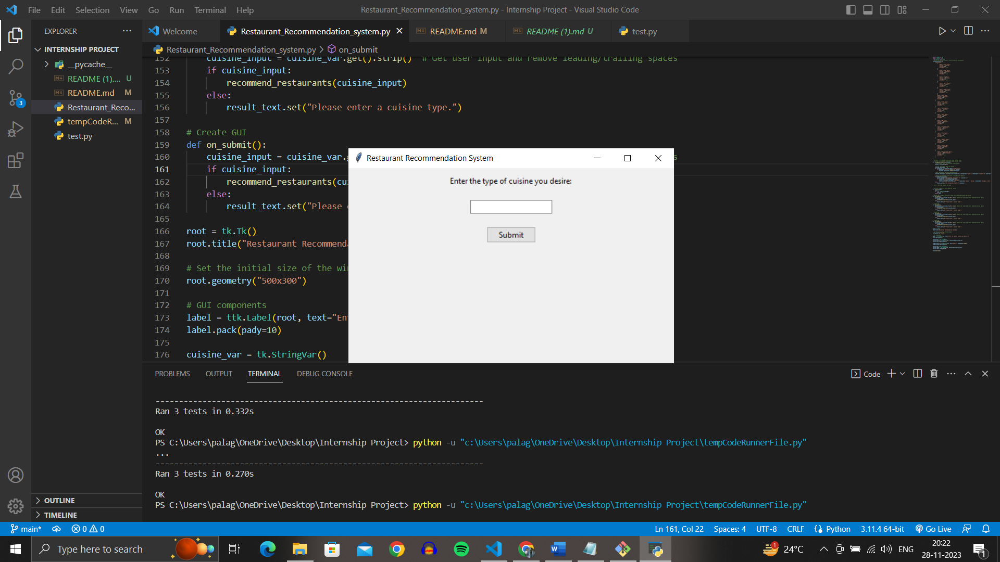
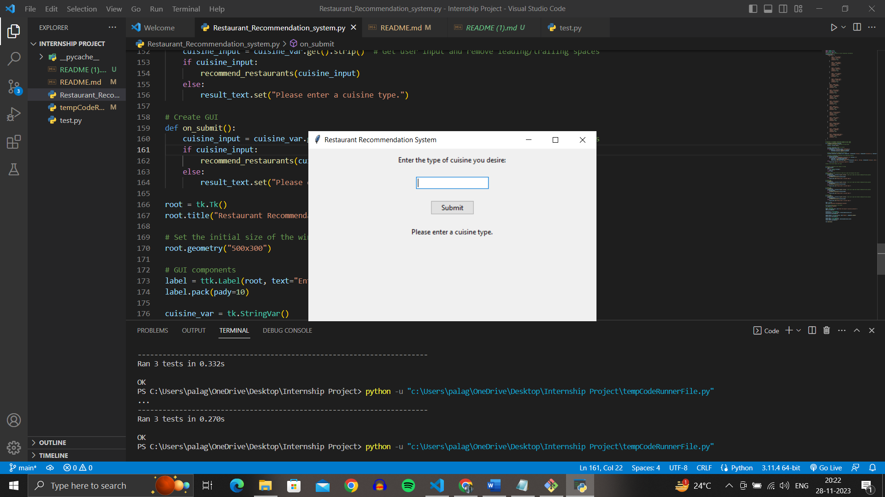
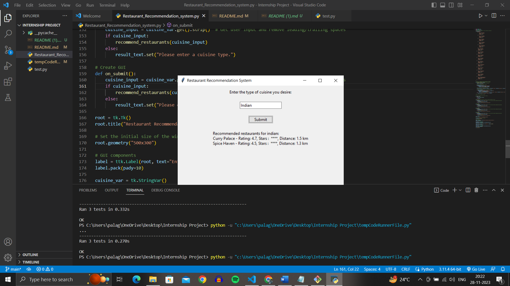
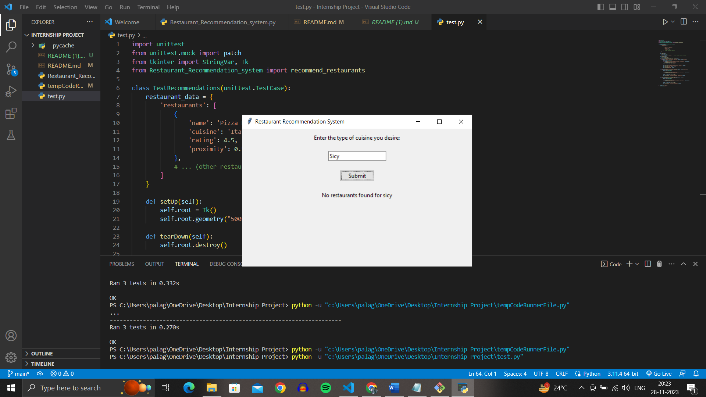
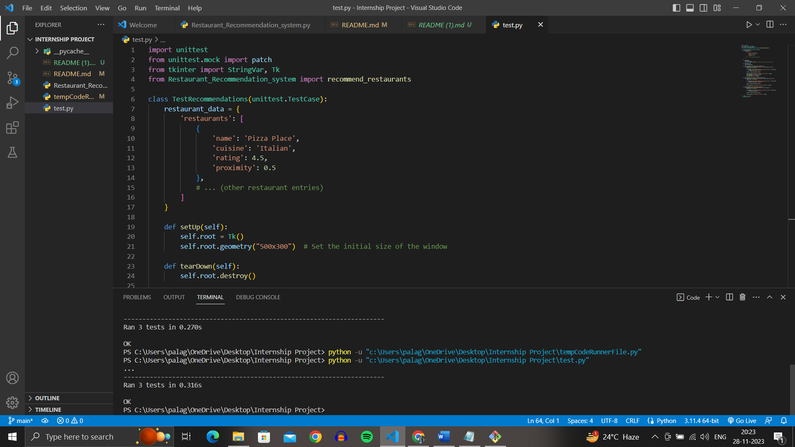

# Restaurant Recommendation System
Overview
This program is a simple restaurant recommendation system with a **graphical user interface (GUI)** built using Tkinter. It allows users to input a cuisine type, and the system recommends restaurants based on the entered cuisine. The recommendations are sorted by restaurant rating and proximity.

# Instructions
# Dependencies:

Ensure you have Python installed on your system.
The program uses the pandas library for data handling and tkinter for GUI. You can install them using:

# pip install pandas
Run the Program:

Execute the main program file restaurant_recommendation_system.py to launch the GUI.

**python restaurant_recommendation_system.py**
# GUI Usage:

**1.Enter the desired cuisine type in the provided entry field.**
**2.Click the "Submit" button to get restaurant recommendations.**
**3.The recommendations will be displayed below the entry field.**
Unit Tests:

The program includes unit tests to ensure the functionality of the recommendation algorithm.
Run the unit tests using the following command:

**python test_recommendations.py**

# Additional Information
## Data Structure:

Restaurant information is stored in a dictionary with the key 'restaurants'.
Each restaurant is represented by a dictionary with keys 'name', 'cuisine', 'rating', and 'proximity'.
Recommendation Algorithm:

The program filters restaurants based on user-input cuisine, sorts them by rating and proximity, and displays the recommendations.
# Unit Tests:

The test_recommendations.py file contains unit tests for the recommendation function.
The setUp and tearDown methods handle GUI initialization and cleanup for testing.

# Screenshots:

Screenshots of the GUI are available in the Git repository for reference.

## Here is Different Cases of Restaurant Recommendation System : 
**1.GUI SCREEN**: 

**2.CASE OF WITHOUT ANY INPUT :**

**3.CASE OF SHOWING OUTPUT :**

**4.CASE OF INVALID INPUT:**

## Here is Different Cases of Test Cases File: 

**1.TEST CASES FILE INPUT :**

**2.TEST CASES EXCUETION SUMMARY :**

